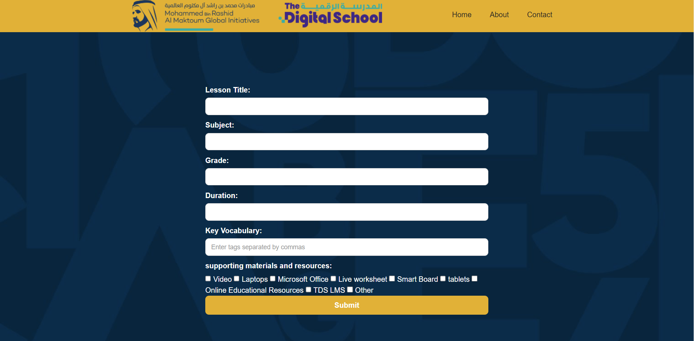

# UAE Digital School X CodersHQ - Lesson Plan Generator
Making lesson plans using Generative AI (GPT-3.5 turbo)

## Table of Contents
- [Introduction](#introduction)
- [Features](#features)
- [Getting Started](#getting-started)
- [Usage](#usage)

## Introduction
This project was created as part of the UAE Digital School X CodersHQ event held on 13-14 June. The goal of the project was to develop a tool using generative AI (GPT 3.5) to assist Digital School and teachers in creating lesson plans.

## Features
- **Generative AI Lesson Plan Creation**: The tool leverages GPT 3.5 to generate lesson plans based on user input.
- **API Integration**: Integration with the organization's website through an API for seamless access to the tool.
- **User-Friendly UI**: A user interface designed to make it easy for teachers to create lesson plans.
- **PDF Generation**: The ability to generate PDF files of lesson plans for easy storage and printing.

## Getting Started
To get started with this project, follow these steps:

1. Clone the repository: `git clone https://github.com/asiln/GPT-Teacher-Planner.git`
2. Install the required dependencies: `pip install -r requirements.txt`
3. add your OpenAI key
4. Run the application: `python main.py`

## Usage
1. Open the application using the provided URL (localhost).
2. Fill in the necessary details to create a lesson plan.
3. Click the "submit" button to let GPT 3.5 create the lesson plan.
4. Review and edit the generated plan as needed.
5. Save or print the lesson plan as a PDF.
